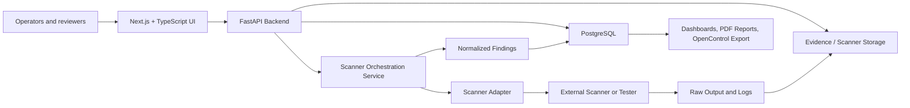

# Architecture Overview

AI Assessment Scanner is a modular monolith with adapter-based scanner orchestration. It is designed to run on one Linux VM with Docker Compose.

## System Architecture

## Frontend

- Next.js App Router.
- TypeScript.
- Operational pages for assessment intake, scanner runs, findings, evidence, review workflows, and executive reporting.
- API-backed data or honest empty states only.

## Backend

- FastAPI service.
- SQLAlchemy models and Alembic migrations.
- Domain services for assessments, scanner runs, findings, evidence, scoring, review workflow, and reporting.
- OpenAPI documentation exposed by FastAPI.

## Database

PostgreSQL stores:

- Systems.
- Assessments.
- Risk profile inputs and scores.
- Scanner runs and results.
- Findings.
- Evidence metadata.
- Review workflow state.
- Framework mappings.
- Reports and export metadata.
- Audit events.

## Scanner Orchestration Flow

1. Operator selects an assessment target and scanner configuration.
2. Backend validates target scope and adapter configuration.
3. Scanner run record is created.
4. Adapter executes an external scanner or tester.
5. Raw output, logs, reports, prompts, and responses are written to storage.
6. Parser normalizes scanner-specific results.
7. Findings and evidence links are created.
8. Risk profile and score records update.

## Evidence Flow

Evidence artifacts are immutable by default. The database stores metadata, references, hashes where available, sensitivity labels, and links to assessments, scanner runs, and findings.

Evidence sources include scanner output, logs, prompts, responses, uploaded files, trace references, review notes, and generated reports.

## Reporting Flow

Reports should be generated from real records:

- Systems and assessments.
- Risk profiles and score history.
- Findings and remediation status.
- Evidence references.
- Review decisions and conditions.
- Framework/control mappings.

Supported reporting targets are dashboards first, then PDF reports and OpenControl / Compliance Masonry exports.

## Deployment Model

Initial production deployment:

- One Linux VM.
- Docker Compose.
- Frontend container.
- Backend container.
- PostgreSQL container or managed PostgreSQL.
- Mounted evidence/scanner storage.
- Optional reverse proxy and TLS.

Do not add Kubernetes, service mesh, distributed workers, or scanner microservices unless production requirements justify them.
