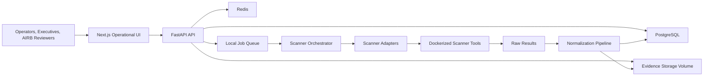

# Architecture Overview

The architecture is a modular monolith with clean internal boundaries and adapter-based scanner orchestration. It should remain easy to operate on one Linux VM while still being structured enough to evolve.

## High-Level Components



## Recommended Repository Layout

Future implementation should use this shape:

```text
/
  apps/
    web/                 # Next.js, React, TailwindCSS, shadcn/ui
    api/                 # FastAPI app
  packages/
    schemas/             # Shared JSON Schema / OpenAPI fragments if useful
  scanner-adapters/
    base/                # Adapter interfaces and test fixtures
    garak/
    pyrit/
    fairlearn/
    promptfoo/
  infra/
    docker/
    compose/
  scripts/
  seed/
  docs/
```

This documentation repository does not yet create application code. It establishes the foundational blueprint that future implementation should follow.

## Backend Architecture

The FastAPI backend should be organized around domain modules:

- `systems`: AI inventory and system ownership.
- `assessments`: assessment plans, runs, status, scanner executions.
- `findings`: normalized findings, triage, remediation.
- `evidence`: artifacts, metadata, hashes, custody.
- `scoring`: score calculation and score explanations.
- `governance`: review workflows, approvals, exceptions.
- `reports`: executive and operational reporting.
- `integrations`: future external workflow integrations.
- `scanner_orchestration`: adapter execution and result normalization.

## Frontend Architecture

The Next.js frontend should use:

- App Router.
- TypeScript.
- TailwindCSS.
- shadcn/ui primitives.
- Recharts for charts.
- TanStack Table for dense operational tables.
- Route groups for dashboard, inventory, findings, evidence, AIRB, approvals, and reports.

The UI should behave like an operational security console, not a marketing site.

## Data Architecture

PostgreSQL is the source of truth for:

- Systems.
- Departments.
- Owners.
- Assessments.
- Scanner runs.
- Findings.
- Evidence metadata.
- Workflow state.
- Decisions.
- Exceptions.
- Scores.
- Framework mappings.
- Reports.

Redis is used initially for:

- Job coordination.
- Short-lived cache.
- Lightweight background processing state.

Redis should not become an unbounded event store in the first implementation.

## Scanner Architecture

Scanners are external tools. The platform integrates them through adapters that:

- Declare supported capabilities.
- Validate inputs.
- Construct CLI or container execution commands.
- Capture raw outputs.
- Normalize results into platform schemas.
- Attach evidence.
- Report execution metadata.

Adapters must not import or depend on scanner internals unless the scanner explicitly provides a stable API.

## Evidence Architecture

Evidence should be stored as immutable artifacts with metadata:

- Raw scanner outputs.
- Prompts.
- Model outputs.
- Screenshots.
- Configuration snapshots.
- Approval records.
- Review notes.
- Generated reports.

The database stores metadata, references, hashes, and custody events. Artifact files can start on a local Docker volume and later move to object storage if required.

## Deployment Architecture

Initial deployment is Docker Compose on one Linux VM:

- `web`.
- `api`.
- `postgres`.
- `redis`.
- `scanner-runner`.
- Optional reverse proxy.

No Kubernetes, service mesh, distributed worker fleet, or cloud-native event pipeline should be introduced before operational workflows prove the need.
