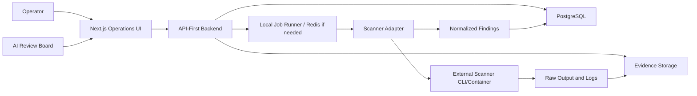

# System Overview

County AI Assurance Operations Center is a governance and assurance platform for public-sector AI systems.

## System Role

The platform is the operational layer that tracks:

- Which AI systems exist.
- Who owns them.
- What assessments have been run.
- What findings exist.
- What evidence supports decisions.
- What risks have been accepted.
- What reviews are pending.
- What must be retested.

## High-Level Architecture

## Planned Components

- Operations UI.
- API backend.
- PostgreSQL database.
- Evidence storage.
- Scanner adapter runner.
- Scoring engine.
- Export/reporting subsystem.

## Deployment Assumption

Initial production should run on one Linux VM with Docker Compose. This is deliberate. The project should remain easy to inspect, back up, patch, and operate.

## Data Flow

1. A system is added to inventory.
2. An assessment is created.
3. Mock findings or scanner results are attached.
4. Findings normalize into a common schema.
5. Evidence records preserve raw material.
6. Scores update.
7. Reviewers approve, block, request remediation, or accept risk.
8. Reports and audit packets are produced.

## Boundary

The platform does not perform scanner logic internally. It orchestrates external tools and turns their results into governance records.
