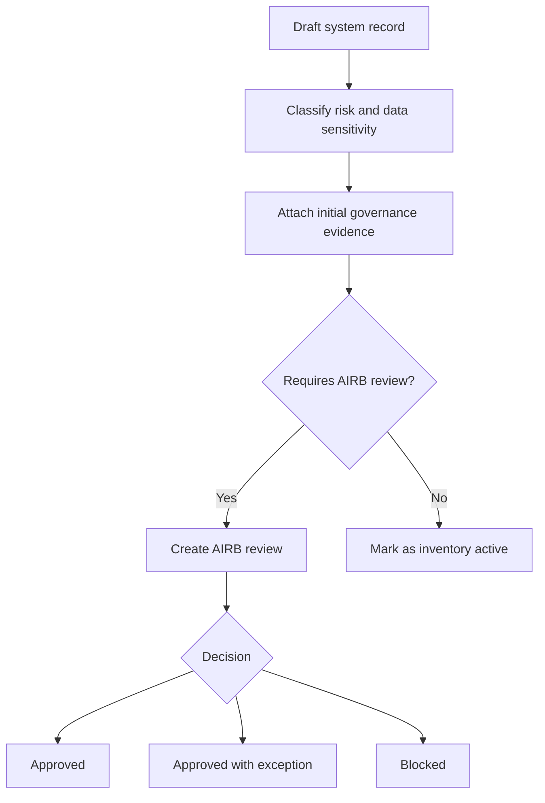
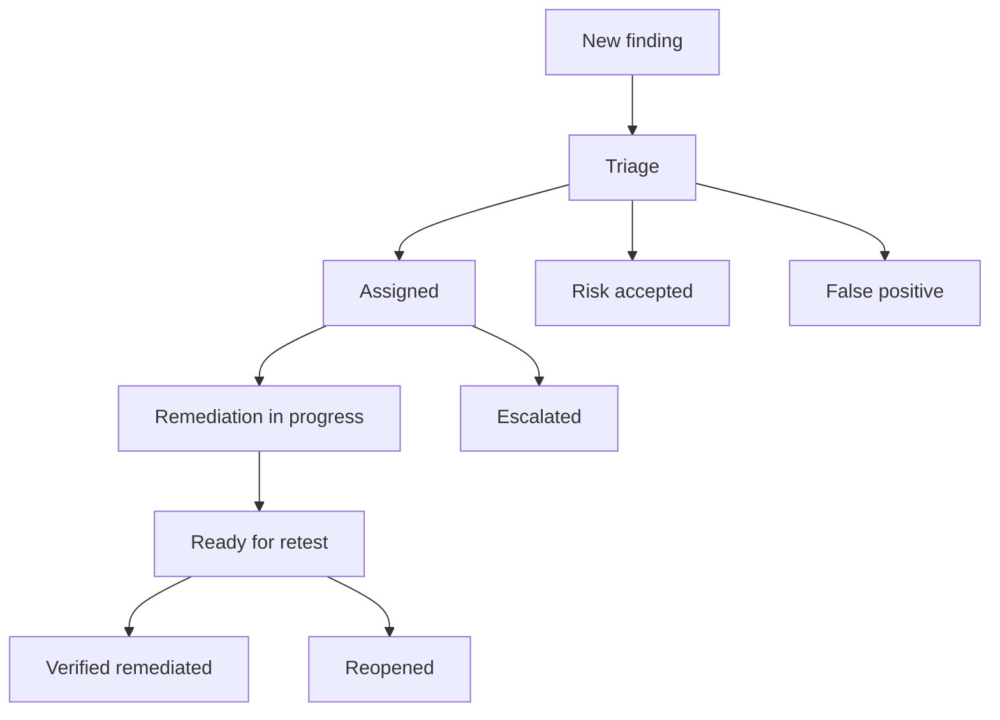
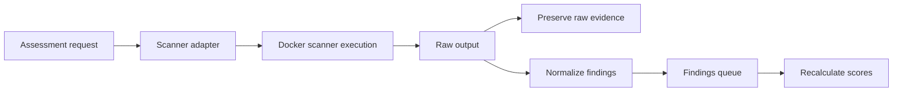
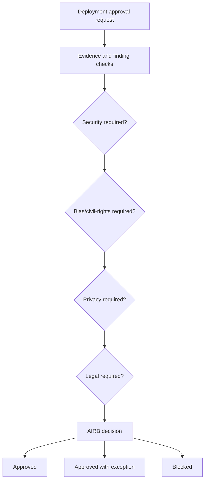

# Operational Workflows

## AI System Intake

## Finding Lifecycle

## Scanner Result Flow

## Deployment Approval Flow

## Daily Operator Workflow

1. Review executive dashboard for score changes and blocked deployments.
2. Open Findings Queue filtered by critical and high severity.
3. Review overdue SLAs.
4. Inspect AIRB Review Queue.
5. Check Evidence and Audit page for incomplete evidence records.
6. Update remediation status and retest records.
7. Generate or refresh governance reports as needed.

## Weekly Governance Workflow

1. Review all high-risk systems.
2. Review systems without recent assessment evidence.
3. Review accepted risks nearing expiration.
4. Review blocked deployments and unresolved blockers.
5. Prepare AIRB packet for pending decisions.
6. Export reports for leadership.
